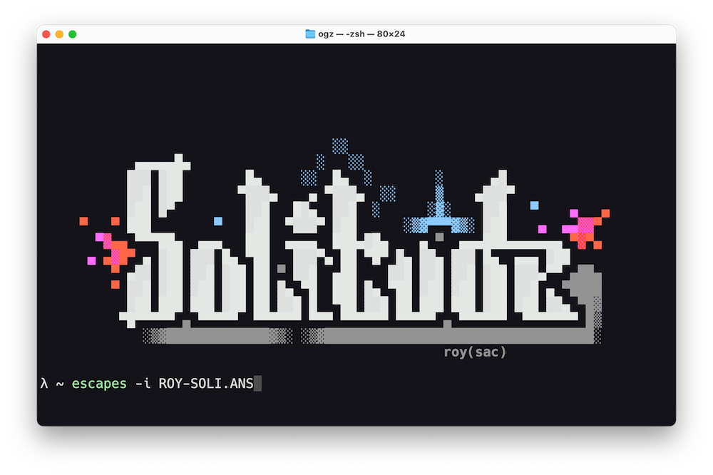

# escapes

Render CP437-encoded ANSI art to UTF-8 terminals.

[](https://pkg.go.dev/github.com/tetsuo/escapes)

## CLI usage

Install the `escapes` CLI tool:

```bash
go install github.com/tetsuo/escapes/cmd/escapes@latest
```

Then run it with a file argument:

```bash
escapes -i file.ans
```

or you can pipe a file into it:

```bash
escapes < file.ans
```

## Resources

Find cool ANSI art at:

- [roy/sac](https://www.roysac.com/roy_ansishow.html)
- [16colo.rs](https://16colo.rs/)



I use the [Hack](https://github.com/source-foundry/Hack) font.
